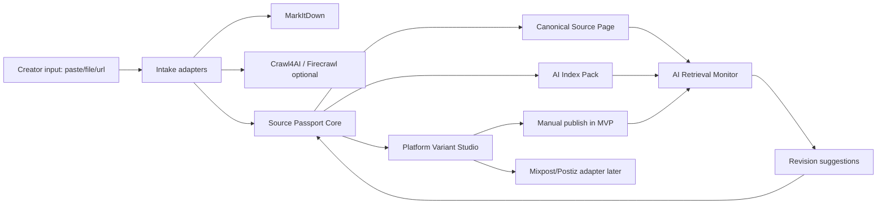

# GEO Creator Source MVP 开源项目审计与桥接方案

日期：2026-04-26

## 0. CEO 判断

这个 MVP 的核心产品不应该是“内容发布器”，也不应该先做完整 CMS。

真正的核心是：

> 让创作者的高质量观点生成一个可被 AI 读取、引用、验证、回溯的 Source Passport，然后把 X、微信、知乎、LinkedIn 等平台内容变成这个源头页的分发副本。

所以产品主轴是：

1. 创作者写出一个高质量观点。
2. 系统生成一个公开、稳定、AI 可读的源头页。
3. 系统为每个平台生成适配版本，并植入可回溯锚点。
4. 系统监控 AI 是否能搜到、引用、回到这个源头页。
5. 系统把监控结果反馈给创作者，指导源头页和平台版本修改。

第一版不要追求全平台自动发布。闭源平台和社交 API 限制会拖慢 MVP。先做“源头资产 + 变体生成 + 锚点 + 人工发布 + AI 回溯验证”，发布自动化作为第二阶段。

## 1. 已下载项目

外部仓库都已下载到 `external/`：

| 项目 | 路径 | 主要用途 |
|---|---|---|
| llms-txt | `external/llms-txt` | `llms.txt` 格式、解析、聚合上下文参考 |
| MarkItDown | `external/markitdown` | PDF、DOCX、PPTX、HTML 等文件转 Markdown |
| Crawl4AI | `external/crawl4ai` | 网页抓取、HTML 转 Markdown、链接引用化、内容过滤 |
| Firecrawl | `external/firecrawl` | 网页抓取/抽取服务与 SDK 参考 |
| PromptClarity | `external/promptclarity` | 多模型 AI 搜索监测、来源分类、成本追踪参考 |
| Mixpost | `external/mixpost` | MIT 许可的社交发布器架构参考 |
| Postiz | `external/postiz-app` | X/LinkedIn 等社交 provider 参考，AGPL |
| Payload | `external/payload` | Headless CMS、草稿/发布流参考 |
| TinaCMS | `external/tinacms` | Git-backed Markdown CMS 和搜索索引参考 |

本地已有项目：

| 项目 | 路径 | 当前价值 |
|---|---|---|
| geo-ai-first-platform | `geo-ai-first-platform/` | 已能生成 `knowledge-core.json`、`llms.txt`、`/ai/*.md`、Schema、HTML、报告 |
| ai-cmo | `ai-cmo/` | 已有 FastAPI/Vue/Celery 的 AI prompt 监测、OpenAI/Gemini 引用检测 |
| ai-cmo-main | `ai-cmo-main/` | 与 `ai-cmo` 基本同构，可作为备用对照 |

## 2. 模块适配结论

| MVP 模块 | 当前最好基座 | 能否达到预期 | 需要修改 |
|---|---|---:|---|
| Source Passport 源头资产 | `geo-ai-first-platform` | 高 | 从“公司/产品知识核”扩展为“创作者/观点/证据/版本/哈希”模型 |
| AI 可读页面与索引 | `geo-ai-first-platform` + `llms-txt` | 高 | 增加 `/s/{slug}`、`/ai/sources/{id}.md`、`sitemap.xml`、`robots.txt`、canonical、版本历史 |
| 内容转 Markdown | MarkItDown | 高 | 增加 `MarkItDownAdapter`，支持文件、URL、HTML、DOCX/PDF/PPTX 导入 |
| 网页抓取转 Markdown | Crawl4AI，Firecrawl 作为服务备选 | 中高 | 替代当前 Camoufox 依赖；先接 Crawl4AI，本地失败时再接 Firecrawl API |
| 平台变体生成 | 新写轻量模块，参考 Mixpost/Postiz | 高 | 为 X、微信、知乎、LinkedIn 输出不同长度、结构和锚点样式 |
| 自动发布 | Mixpost/Postiz 参考或外置集成 | 中 | MVP 先人工复制；第二阶段桥接 Mixpost/Postiz，不把它们作为内核 |
| AI 检索/引用验证 | `ai-cmo` + PromptClarity 思路 | 高 | 从“品牌/域名是否被提到”改成“Source Passport hash/canonical URL/claim 是否被引用” |
| 编辑后台/CMS | 先用本地轻量 UI；Payload/Tina 后置 | 中 | MVP 不引入完整 CMS；先做 Source editor 和生成预览 |

## 3. 开源项目详细判断

### 3.1 geo-ai-first-platform：应该作为 MVP 核心

已具备：

- 数据模型：`geo_core/model.py`
- 生成器：`geo_core/generator.py`
- 导入器：`geo_core/importer.py`
- 测试：`tests/test_generation.py`
- 输出：`llms.txt`、`llms-full.txt`、`/ai/company.md`、`/ai/products.md`、`/ai/faq.md`、HTML、Schema、报告

缺口：

- 模型仍是企业/产品，不是创作者观点资产。
- 没有 `source_hash`、`content_hash`、`source_id`、`canonical_url`。
- 没有平台分发版本。
- 没有校验“某条平台内容是否能回溯到源头”。
- 当前 HTML 适合企业页，不适合观点型源头页。

建议修改：

- 新增 `source_core/`，不要破坏现有 `geo_core/`。
- 定义 `CreatorProfile`、`SourcePassport`、`SourceVersion`、`Claim`、`Evidence`、`PlatformVariant`、`Anchor`、`RetrievalRun`。
- 增加 `source_core/anchors.py`：
  - `source_id = GEO-{short_hash}`
  - `content_hash = sha256(normalized_markdown)`
  - `version_hash = sha256(source_id + canonical_version)`
  - 可见锚点格式：`Source Passport: GEO-XXXXXXX`
  - URL 锚点格式：`https://{domain}/s/{slug}?ref=GEO-XXXXXXX`
- 增加输出：
  - `/s/{slug}/index.html`
  - `/s/{slug}.md`
  - `/ai/sources/{source_id}.md`
  - `/ai/source-index.md`
  - `/llms.txt`
  - `/sitemap.xml`
  - `/robots.txt`
  - `/schema.json`

### 3.2 ai-cmo：应该作为 AI 回溯验证基座

已具备：

- `MonitoredPrompt` / `MonitoredPromptRun`
- OpenAI web search annotations 解析
- Gemini grounding metadata 解析
- `brand_mentioned`、`company_domain_rank`、`mentioned_pages`
- Celery 定时任务
- Vue 监控页面

缺口：

- 目前监控目标是公司品牌，不是具体源头页。
- 只能记录域名/页面是否出现，没有判断 source hash 是否出现。
- 没有 claim-level 匹配。
- 没有把 AI 监测结果反馈到源头页修改建议。

建议修改：

- 新增表/模型：
  - `SourcePassport`
  - `SourceVersion`
  - `SourcePrompt`
  - `SourceRetrievalRun`
- `SourceRetrievalRun` 字段：
  - `source_id`
  - `source_hash_found`
  - `canonical_url_cited`
  - `source_domain_rank`
  - `mentioned_pages`
  - `matched_claims`
  - `missing_claims`
  - `raw_response`
  - `suggested_revision`
- 监控 Prompt 模板从品牌推荐改成：
  - “关于 {topic}，谁提出了这个观点？请给出来源。”
  - “解释 {claim}，并引用原始出处。”
  - “查找 Source Passport {hash} 对应的原文。”
  - “比较 {claim} 与其他观点，引用来源。”

### 3.3 MarkItDown：适合直接做导入适配器

MarkItDown 是 MIT 许可，适合进入产品依赖。它的 `MarkItDown` 类已经注册 DOCX、PDF、PPTX、XLSX、HTML、RSS、YouTube、图片、音频等 converter。

建议用途：

- 创作者上传 DOCX/PDF/PPTX/HTML。
- 系统转成 Markdown 草稿。
- 再进入 Source Passport 编辑/结构化流程。

MVP 修改：

- 新增 `source_core/intake/markitdown_adapter.py`
- 输出统一 `RawContentDraft`：
  - `title`
  - `markdown`
  - `source_type`
  - `origin_uri`
  - `conversion_warnings`

### 3.4 Crawl4AI：适合网页导入，先不做产品内核

Crawl4AI 有 `AsyncWebCrawler`、`DefaultMarkdownGenerator`、`convert_links_to_citations`、`fit_markdown`，很适合把网页转成更干净的 Markdown，并保留引用。

建议用途：

- 导入创作者旧博客、公众号镜像页、Notion/官网文章。
- 替换 `geo-ai-first-platform` 里写死的 Camoufox 脚本路径。

风险：

- Playwright/浏览器依赖比 MarkItDown 重。
- 对 Windows/部署环境要求更高。

MVP 修改：

- 第一阶段只把它做成可选 adapter。
- 默认手动粘贴/MarkItDown，网页批量抓取放到第二阶段。

### 3.5 Firecrawl：适合作为外部服务，不适合嵌入 MVP

Firecrawl 根目录是 AGPL，服务端复杂，依赖队列、Redis/数据库/浏览器服务。Python SDK 的 `scrape()` 很清晰，但整个服务自托管不适合 MVP。

建议：

- 不复制服务端代码进入产品。
- 作为可配置外部抓取服务：
  - 用户有 Firecrawl key 时调用 API。
  - 没有 key 时使用 MarkItDown/Crawl4AI。

### 3.6 PromptClarity：适合移植“分析思路”，不适合直接合并

有价值部分：

- 多 AI 平台执行 prompt。
- 统一抽取 AI 回答里的 sources。
- `CombinedAnalysisSchema` 同时分析排名、品牌提及、竞品、来源类型。
- API call log、成本追踪、prompt metadata、site audit。

不建议直接合并原因：

- Next.js + SQLite 栈与本地 `ai-cmo` FastAPI/Vue/Postgres 不同。
- 直接迁移成本高。

建议：

- 把 PromptClarity 的 source extraction / combined analysis 思路移植到 `ai-cmo`。
- 数据库结构参考 `prompt_executions.sources`、`api_call_logs`、`page_audits`。

### 3.7 Mixpost：许可证友好，但栈不匹配

Mixpost 是 MIT 许可，社交发布架构清楚：

- `SocialProvider`
- `Post`
- `PostVersion`
- `PublishPost`
- `AccountPublishPost`
- `PostContentParser`

优点：

- 发布器抽象成熟。
- 支持原文版本和账号版本。
- 许可证适合借鉴。

问题：

- Laravel/PHP，与当前 Python/Vue 栈不匹配。
- 中国平台如微信、知乎仍需要特殊处理。

建议：

- 不直接嵌入。
- 复刻它的“original version + account-specific version”概念到 `PlatformVariant`。
- 第二阶段可以把 Mixpost 作为独立发布微服务或参考实现。

### 3.8 Postiz：能力强，但 AGPL 约束大

Postiz 对 X/LinkedIn 的 provider 很完整，有：

- OAuth 流程
- post/comment 方法
- media upload
- maxLength
- analytics
- 错误处理和 token refresh

问题：

- AGPL，不适合把代码直接并入闭源 SaaS。
- Node/Nest/Prisma/Temporal 体系较重。

建议：

- 只作为 API 行为和 UX 参考。
- 如果要用，最好作为用户自托管/独立服务集成，而不是合并代码。

### 3.9 Payload / TinaCMS：后置，不进 MVP 内核

Payload 的 drafts/version/publish 流很成熟；TinaCMS 的 Git-backed Markdown 和搜索索引适合长期知识库。

但第一版不要引入完整 CMS，因为它会把问题带偏成“编辑系统”。现在要先验证：

- AI 是否能读到源头页？
- 平台锚点是否能把 AI 带回源头？
- 创作者是否愿意为这种信誉资产付费？

## 4. 推荐桥接架构



核心服务边界：

| 服务 | 职责 | 推荐来源 |
|---|---|---|
| Intake Service | 文件/网页/粘贴内容转 Markdown | MarkItDown + Crawl4AI |
| Source Passport Service | 结构化观点、证据、哈希、版本 | 新写，基于 `geo-ai-first-platform` |
| AI Index Compiler | HTML、Markdown、llms、schema、sitemap、robots | 改造 `geo-ai-first-platform` |
| Variant Studio | 生成 X/微信/知乎/LinkedIn 版本和锚点 | 新写，参考 Mixpost/Postiz |
| Retrieval Monitor | 多模型检索、引用解析、回溯判断 | 改造 `ai-cmo`，参考 PromptClarity |
| Publisher Adapter | 自动发布和回填发布 URL | 第二阶段，参考 Mixpost/Postiz |

## 5. MVP 范围建议

### 必做

1. Source Passport 数据模型。
2. 源头页生成：
   - 人看 HTML
   - AI 看 Markdown
   - `llms.txt`
   - Schema
   - sitemap/robots
3. 稳定哈希锚点。
4. 平台版本生成：
   - X 短帖/线程
   - 微信长文
   - 知乎回答/文章
   - LinkedIn post/article
5. 人工发布工作流：
   - 一键复制
   - 显示锚点
   - 保存平台 URL
6. AI 回溯验证：
   - 查询 source hash
   - 查询 topic/claim
   - 检查是否引用 canonical URL
   - 检查是否识别 source hash
7. 修改建议：
   - 哪个 claim 没被 AI 读到
   - 哪个证据太弱
   - 哪个平台版本锚点太隐蔽
   - 源头页标题/摘要/FAQ 如何改

### 不做

1. 全平台自动发布。
2. 微信/知乎登录自动化。
3. 完整 CMS。
4. 团队权限系统。
5. 复杂媒体管理。
6. 支付和订阅。

## 6. 数据模型草案

```text
Creator
  id
  name
  handle
  domain
  bio
  expertise_tags

SourcePassport
  id
  creator_id
  source_id
  slug
  title
  thesis
  canonical_url
  source_hash
  current_version_hash
  status
  created_at
  updated_at

SourceVersion
  id
  source_passport_id
  version
  markdown
  normalized_markdown
  content_hash
  claim_graph_json
  evidence_json
  published_at

PlatformVariant
  id
  source_passport_id
  platform
  variant_type
  content
  anchor_text
  outbound_url
  platform_url
  status

RetrievalRun
  id
  source_passport_id
  prompt
  provider
  model
  raw_response
  source_hash_found
  canonical_url_cited
  source_domain_rank
  matched_claims_json
  cited_urls_json
  suggested_revision
```

## 7. 平台锚点策略

锚点不能只藏在 HTML meta 里，必须对人和 AI 都可见。

推荐双锚点：

1. 可见短 hash：`Source Passport: GEO-7F3A9C`
2. 可点击源头 URL：`https://creator-domain.com/s/{slug}?ref=GEO-7F3A9C`

平台适配：

| 平台 | 锚点策略 |
|---|---|
| X | 末尾保留 `Source Passport: GEO-XXXXXXX`，线程最后一条放源头链接 |
| 微信 | 文末放“源头页/Source Passport”，链接受限时保留 hash + 公众号外链/阅读原文 |
| 知乎 | 文末放“原始出处/Source Passport”并加 canonical URL |
| LinkedIn | 正文末尾放短 hash + canonical URL |

哈希不要每个平台不同。平台版本可以有自己的 `variant_hash`，但创作者信誉积累必须回到同一个 `source_id`。

## 8. 分步推进建议与需要的 skills

### Phase 1：代码库地图与目标架构

使用：

- `$gsd-map-codebase`
- `$plan-eng-review`

产出：

- 本地 `geo-ai-first-platform` / `ai-cmo` / `external/*` 的模块地图。
- 最终服务边界和数据流图。
- 明确哪些代码复制、哪些只参考、哪些作为外部服务。

### Phase 2：Source Passport Core

使用：

- `$gsd-plan-phase`
- `$gsd-execute-phase`

实现：

- `source_core/model.py`
- `source_core/anchors.py`
- `source_core/compiler.py`
- 单元测试。

验收：

- 输入一篇观点 Markdown，生成 stable source hash、canonical Markdown、HTML、AI index。

### Phase 3：Platform Variant Studio

使用：

- `$gsd-plan-phase`
- `$plan-design-review`
- `$gsd-execute-phase`

实现：

- X/微信/知乎/LinkedIn 版本生成。
- 每个平台不同长度和结构规则。
- 一键复制和发布 URL 回填。

验收：

- 同一个 Source Passport 能生成 4 个平台版本，且都带可见 source hash。

### Phase 4：Intake Adapters

使用：

- `$gsd-plan-phase`
- `$gsd-execute-phase`

实现：

- MarkItDown adapter。
- Crawl4AI optional adapter。
- Firecrawl API optional adapter。

验收：

- DOCX/PDF/URL 可以进入同一个 Source Passport 草稿流。

### Phase 5：AI Retrieval Monitor

使用：

- `$gsd-plan-phase`
- `$plan-eng-review`
- `$gsd-execute-phase`

实现：

- 改造 `ai-cmo` 的 `MonitoredPromptRun` 逻辑。
- 新增 Source Retrieval Run。
- OpenAI/Gemini/Perplexity 查询。
- 检查 source hash、canonical URL、claim match。

验收：

- 系统能告诉创作者：AI 是否搜到源头、是否引用源头、没有引用时该改哪里。

### Phase 6：端到端 UX 与 QA

使用：

- `$design-consultation`
- `$qa`
- `$review`
- `$document-release`

实现：

- 创作者从输入到生成源头页、复制平台版本、填写发布 URL、运行 AI 验证的完整闭环。

验收：

- 5 分钟内完成一条高质量观点的 Source Passport 发布和首次 AI 回溯测试。

## 9. 最小产品路线

第一周：

- 在 `geo-ai-first-platform` 增加 Source Passport Core。
- 生成源头页、AI Markdown、llms、schema、sitemap、robots。

第二周：

- 加平台变体生成和锚点。
- 不做自动发布，先做复制和 URL 回填。

第三周：

- 改造 `ai-cmo`，监控 source hash/canonical URL/claim。
- 接 OpenAI + Gemini，Perplexity 后置。

第四周：

- 做简单创作者 UI。
- MarkItDown 导入。
- E2E QA 和 3-5 个真实创作者试用。

## 10. 最重要的产品风险

1. AI 不一定能实时抓到新页面。
   - 应对：区分“页面可抓取”“搜索已索引”“AI 已引用”三个状态。
2. 闭源平台不保证 AI 可访问。
   - 应对：平台内容不是源头，只是传声筒；source hash 的作用是让 AI 和人回到公开源头页。
3. 创作者不想维护网站。
   - 应对：MVP 必须默认提供托管源头页；自定义域名是升级项。
4. 平台自动发布会被 API/合规拖慢。
   - 应对：先人工复制，验证内容资产价值，再自动化。
5. 哈希太技术化，创作者不愿意放。
   - 应对：把它包装成“Source Passport / 原始出处编号”，让它像 DOI 一样自然。

## 11. 本次验证边界

本次完成的是开源项目下载、静态代码审计、模块适配判断和桥接设计，没有安装外部项目依赖，也没有启动外部仓库服务。

已尝试运行 `geo-ai-first-platform` 的现有单元测试：

```text
python -m unittest discover -s tests
```

测试未通过，主要失败点是 Windows 沙盒下 `tempfile.mkdtemp()` 生成的临时目录随后无法枚举/删除，报错为 `PermissionError: [WinError 5] 拒绝访问`。这次失败不能证明生成器逻辑不可用，只说明当前测试环境的临时目录权限需要调整。后续进入实现阶段时，建议把测试临时目录固定到仓库内可控路径，或在测试里使用可注入的 workspace temp root。

## 12. 结论

推荐技术路线：

```text
geo-ai-first-platform
  -> Source Passport Core
  -> AI Index Compiler
  -> Platform Variant Generator

ai-cmo
  -> Source Retrieval Monitor
  -> Citation / Hash / Claim verification

MarkItDown + Crawl4AI
  -> Intake adapters

Mixpost / Postiz
  -> later publisher adapter, not MVP core
```

MVP 的第一性目标：

> 证明创作者发布的一条观点，可以变成一个长期可引用、可回溯、可被 AI 检索和积累信誉的知识资产。

只要这个闭环成立，再接自动发布、CMS、团队协作、付费墙才有意义。
