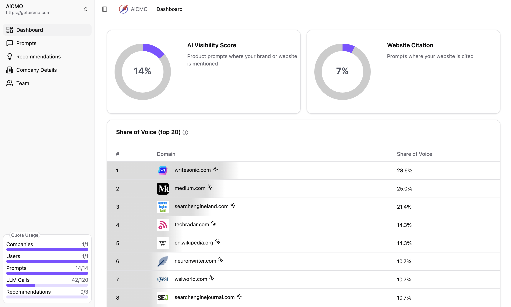
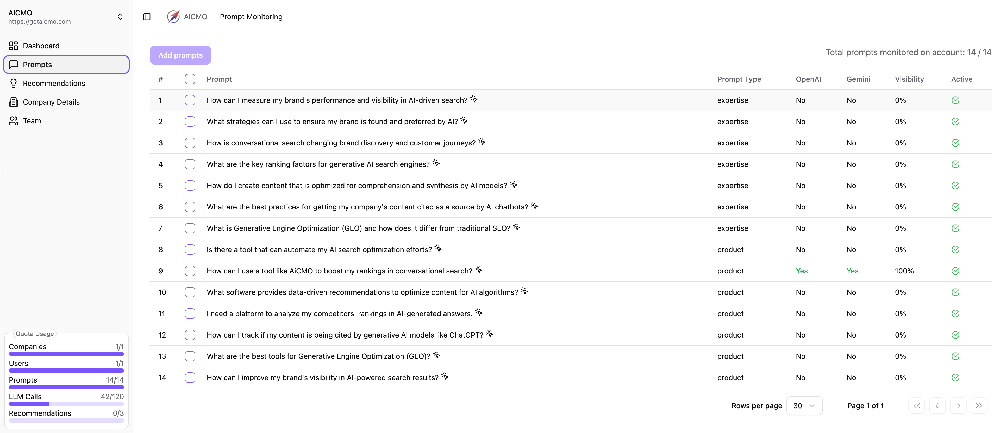
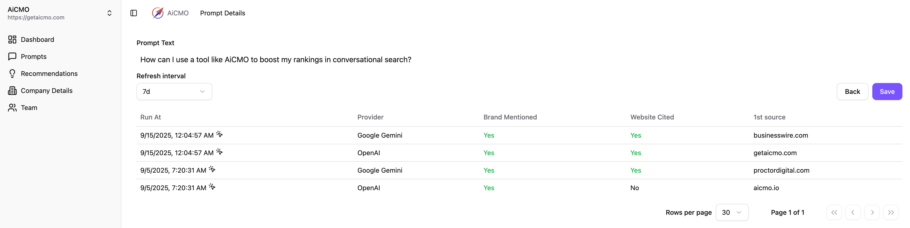

# AiCMO - open-source AI SEO tool (GEO/AIO)

AiCMO is an open-source AI SEO (search optimization) platform that helps companies monitor and optimize their brand visibility in AI tools like ChatGPT, Gemini/Google, Perplexity, Claude, etc. 
Track how often your brand appears in AI responses, analyze competitor performance, and get actionable recommendations to improve your presence in conversational AI search results.

## ✨ Core Features

- **Real-time Brand Monitoring**: Track brand mentions and citations across major AI platforms
- **Competitive Intelligence**: Analyze share of voice and benchmark against competitors
- **Authority Tracking**: Identify which sources AI models cite most frequently in your domain
- **Actionable Insights**: Get AI-powered recommendations to improve brand visibility
- **Multi-Model Support**: Monitor performance across ChatGPT, Gemini, and other AI platforms
- **Self-Hosted Option**: Deploy on your infrastructure with full data control

## 📊 Screenshots

### Dashboard Overview
Monitor your AI visibility score and website citation rate at a glance. Track share of voice metrics to see how your brand compares to competitors across AI-generated responses.



### Prompt Monitoring
Configure and track custom prompts relevant to your industry. Monitor which AI models (OpenAI, Gemini) mention your brand and track visibility percentages across different query types.



### Detailed Analytics
Dive deep into individual prompt performance. See exactly when and where your brand was mentioned, which websites were cited, and track the most authoritative sources in AI responses over time.




## 📦 Deployment

### AI CMO Cloud

Managed deployment by the AI CMO team, generous free-tier, no credit card required.

[AI CMO Cloud](https://getaicmo.com/)

### Self-hosting

Run AiCMO on your own infrastructure. You will need a Vertex AI credentials (Service Account) file and an OpenAI API key.

1. Clone the repository
   ```bash
   # Clone the repository
   git clone https://github.com/AICMO/ai-cmo.git

   # Navigate to the backend directory
   cd ai-cmo/backend
   ```

2. Copy your Vertex AI credentials (Service Account) file to the root of the backend directory and name it `vertex_credentials.json`.
Backend will not start without this file


3. Create .env.local file in the backend directory and add the following variables:
   ```bash
   echo AC_OPENAI_API_KEY=your_openai_api_key >> .env.local
   ```

4. Run the following command to start the AiCMO:
   ```bash
   docker compose up -d
   ```

5. Open http://localhost:8081 in your browser to access the AiCMO frontend.
